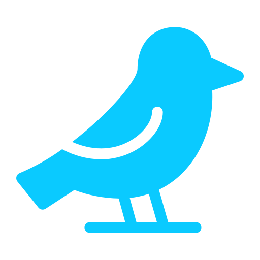
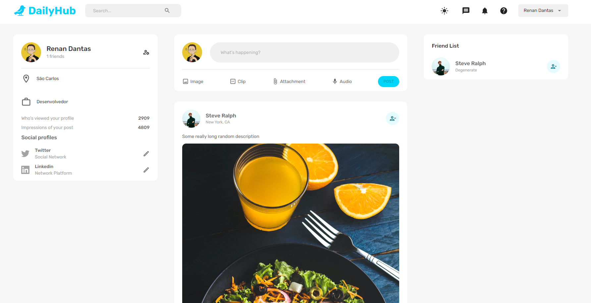
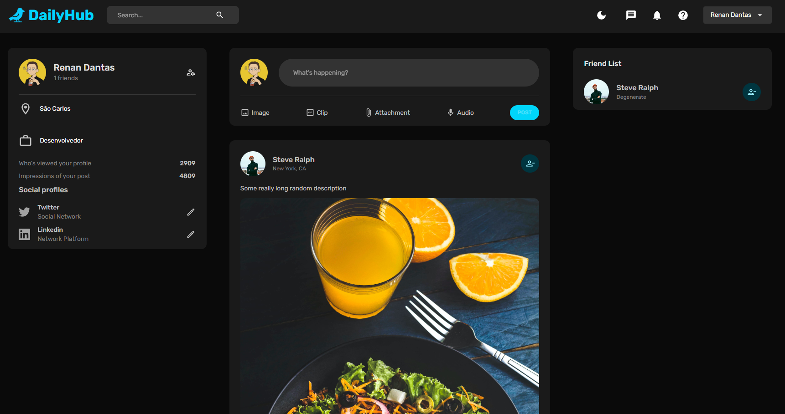
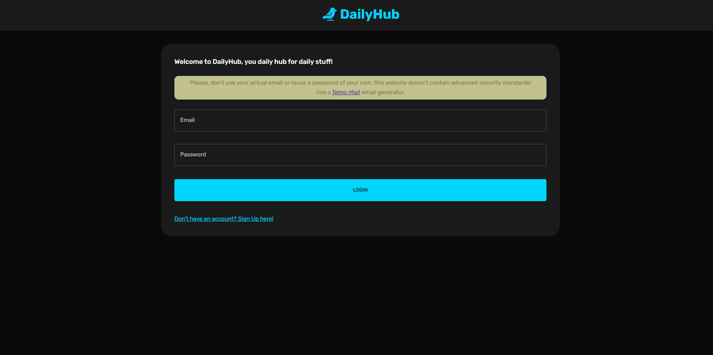

#  **[DailyHub](https://dailyhub.onrender.com) - A Twitter-like app made with the MERN Stack**

 Dailyhub is hosted @ [here](https://dailyhub.onrender.com)!

---
## **The Stack**

The MERN stands for MongoDB, Express, React and Node, which are the four main technologies of this stack for fullstack applications. These four technologies are used for:

- MongoDB - A NoSQL Database. It is used as the main technologies for handling the database with a document-oriented paradigm.
- Express - The NodeJS web framework, which provides a set of features for web and mobile applications.
- React - A javascript framework for building user interfaces based on UI components.
- NodeJS - The javascript server enviroment, alongside with express, GET, POST and other requests can be done connecting the server with the database.

Alongside React, other packages were used to build the User Interface, such as: *React Redux* and *MaterialUI*.

--- 
Currently, some of the features implemented on DailyHub are:

    - Creating account with a profile image
    - Posts
      - Adding posts with or without images
      - Liking Posts
    - Friends
      - Adding and removing friends
    - User experience
      - Light and Dark mode
      - User profile page (currently with some bugs)

---

## **Some Screenshots**

